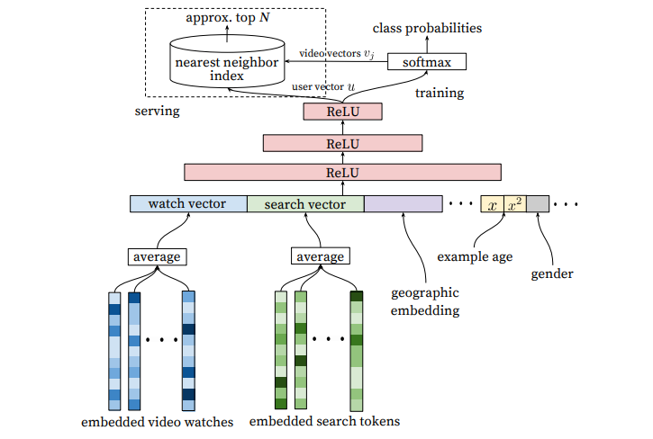

# Positional Recommendation System

**The goal of this project is developing a new positional(sequence-based) recommendation system and comparing it against existings.**

We will write a paper on this project and name of all contributors will be accepted as an author of paper.
Thanks for contribution!!!

List of the models:

   1) Deep Neural Networks for YouTube Recommendations(candidate generation)
     
    
   2) 
   